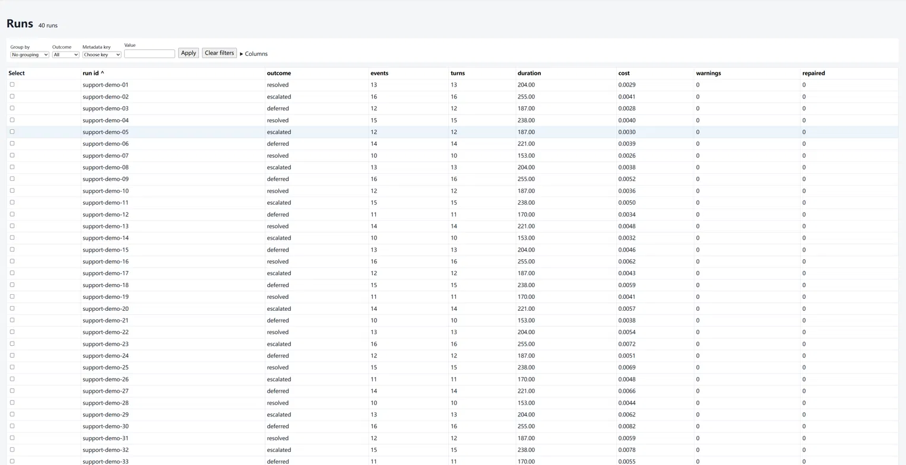
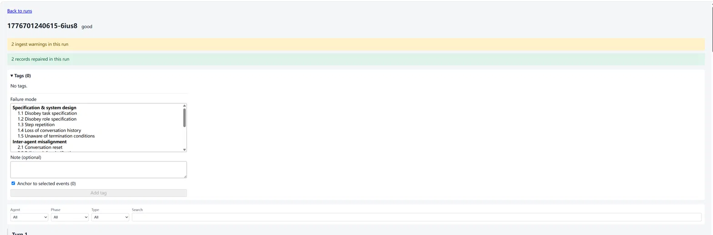
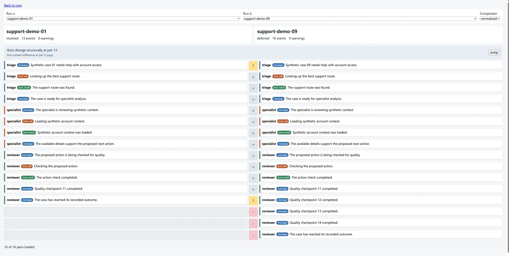

# Retrace

Retrace is a local-first viewer for inspecting, replaying, tagging, and comparing
structured multi-agent logs. It is an offline inspection tool, not a monitoring
service, SDK, or cloud platform.

See the [changelog](CHANGELOG.md) for release notes.

## Why local

Retrace makes zero outbound network requests. It binds 127.0.0.1, serves only your own browser, reads your logs, and writes only *.retrace.json sidecars next to them plus its own cache in your user cache directory. Any data leaving the machine can only be a user-initiated explicit job - and none exist in v1.

- Inputs are parsed read-only and never executed; scripts shipped with a dataset are never run.
- The cache holds parsed copies of your logs in the user cache directory; delete it to remove them.
- Sidecars hold your tag notes.

The promise is enforced by the public test suite: `tests/test_no_outbound_network.py` checks for no outbound-capable imports and no external URLs in the served UI; `tests/test_tags.py` verifies source logs are byte-identical after tagging by comparing bytes and mtime; and `tests/test_server.py` verifies the server binds 127.0.0.1 by default.

## What it looks like

**Batch table** - filter, sort, and group runs by outcome or metadata:



**Replay** - step through a run turn by turn; warning and repair banners
flag ingest issues at a glance:



**Compare** - side-by-side structural alignment of two runs with a
divergence gutter:



## Install

PyPI publication has not happened. From a checkout, install the `retrace-logs`
console script with pipx:

```shell
pipx install .
```

An optional native indexer (`native/jsonl-index`, C++17, built with CMake) can speed up re-reading large JSONL files; everything works without it.

## 60-second quickstart

From the repository checkout, validate the included data and start the viewer:

```shell
retrace-logs check demo/
retrace-logs view demo/
```

The check reports 40 runs, 523 events, and zero warnings. The viewer opens a
local browser page with those 40 runs and a five-tag failure-mode distribution.
Use `retrace-logs view demo/ --no-browser` when a browser must not be opened.

tested against real AG2 and HyperAgent traces from the MAST corpus (config-only); free-text logs are out of scope in v1.
(HyperAgent traces ingest as content-only events - no agent or turn fields exist in the source.)
Measured results: [docs/compatibility.md](docs/compatibility.md).

The batch view lists runs, outcomes, costs, metadata filters and groups, and the
MAST tag distribution. It is the starting point for opening or selecting runs.

The replay view presents one run as an ordered timeline, with agent, phase,
event-type, and text filters. It also lets you add run-level or event-anchored
failure tags and notes.

The compare view aligns two selected runs and identifies structural and content
divergences. Comparison uses the stored event sequence; it is not semantic
similarity analysis.

## Bring your own structured logs

Retrace accepts structured logs (JSON/JSONL, any of the supported layouts: one
file per run, one directory per run, one line per run, one JSON document per
run).

Draft and refine a declarative mapping, validate it, then view the result:

```shell
retrace-logs init path/to/logs --out path/to/logs/retrace.yaml
# Edit path/to/logs/retrace.yaml.
retrace-logs check path/to/logs
retrace-logs view path/to/logs
```

See the [mapping reference](docs/mapping.md), Python adapter protocol (a typed
extension seam; custom Python adapters are not loadable in v1 - see
[docs/adapters.md](docs/adapters.md)), and [tagging guide](docs/tagging.md).

This is the author's real experiment corpus, included because it contains real
logging defects the tool repairs and flags; the game domain is irrelevant.

Shipped builtins are `builtin:ag2` (one JSON document per run, `unit: json`),
`builtin:support_pipeline` (one directory per run), and `builtin:avalon`
(one JSONL line per run).

## Optional native indexer

Large JSONL files are re-read on every line-unit ingest. The optional
indexer in `native/jsonl-index` (C++17, CMake 3.20+, no runtime
dependencies) reads a file once and writes a small `.ridx` sidecar
recording the byte offset, length, and status of every physical line,
so the Python reader seeks straight to a record instead of re-parsing
the file. Everything works without it: the reader falls back to the
plain path when no valid index exists, and a stale or malformed index
is never trusted.

Build and use:

```shell
cmake -S native/jsonl-index -B build -DCMAKE_BUILD_TYPE=Release
cmake --build build
ctest --test-dir build
build/retrace-jsonl-index path/to/logs.jsonl            # writes logs.jsonl.ridx
build/retrace-jsonl-index path/to/logs.jsonl --validate # also checks UTF-8 and JSON
```

The default build classifies lines by their first byte; `--validate` adds
strict UTF-8 and JSON checks via nlohmann/json. Measured on a 190 MB
corpus-derived file, the default build takes 0.007 s against 0.470 s for
a full Python parse; the validated build is slower than a Python parse.
The sidecar layout is documented in
[native/jsonl-index/FORMAT.md](native/jsonl-index/FORMAT.md), the Python
reader that consumes it is `retrace.core.jsonl_index`, and the full
measurements are in [docs/compatibility.md](docs/compatibility.md).
Twenty-five GoogleTest cases and a Python parity test run in CI against
the freshly built binary.

## How it was built

Built with heavy AI assistance under a review-gated workflow.

## License

Apache License 2.0. See [LICENSE](LICENSE).
